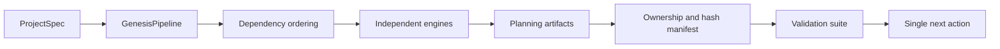

# Framework Architecture

## Context

Project Genesis accepts a three-field project specification and creates a planning
repository for product, architecture, security, engineering, testing, delivery, and AI
execution stakeholders. It does not generate application code.

## Container view

- **CLI:** validates operator input and presents generation, validation, and resume.
- **Pipeline:** topologically orders independent engines and records ownership.
- **Engines:** generate bounded artifact groups through shared immutable context.
- **Template renderer:** strictly resolves declared placeholders.
- **Diagram pipeline:** serializes Mermaid, parses that authoritative source, and emits
  a SHA-linked portable SVG derivative.
- **Validation suite:** inspects generated repositories without mutating them.
- **Memory system:** provides narrative context plus a machine-readable resume cursor.

## Processing flow

## Dependency rules

Models and safe I/O are innermost. Engines depend on those abstractions. The pipeline
depends on engine contracts, not engine internals. The CLI depends on pipeline and
validation facades. Validators are read-only and do not depend on generation behavior
except stable public artifact contracts.

## Determinism

Inputs are normalised, collections sorted, JSON canonicalised, newlines fixed, and time
supplied explicitly. The default timestamp is the reproducible-build epoch. Artifact
hashes exclude the manifest itself and prove a generated baseline has not drifted.

## Safety

All writes are resolved beneath the requested output root. Traversal is rejected.
Nonempty unowned output directories are rejected unless the caller explicitly opts in.
The dependency-free runtime minimises supply-chain exposure.

## Extension model

Add an `EngineSpec` and `Engine` implementation, declare dependencies and owned outputs,
register validators, add schemas/templates, and extend contract tests. Technology or
organisation profiles belong in adapters and overlays rather than core assumptions.
